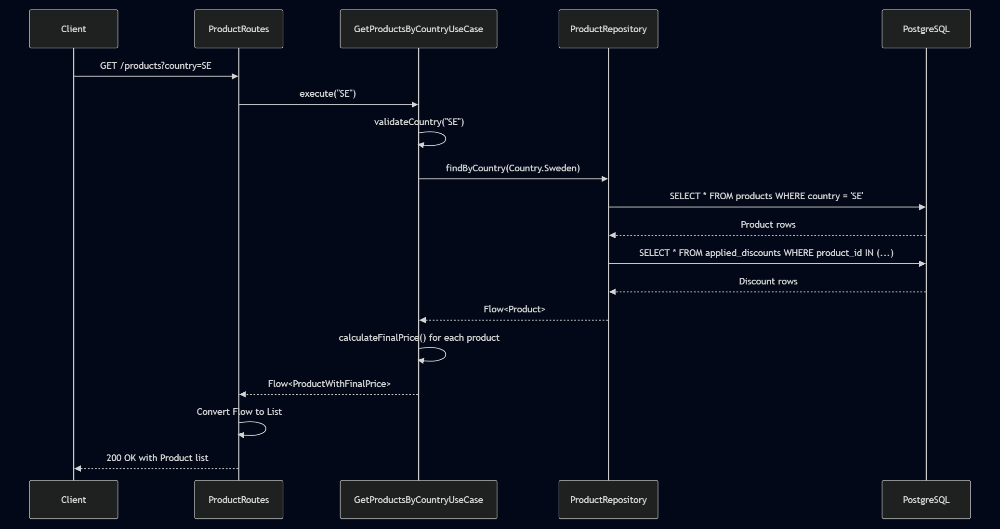
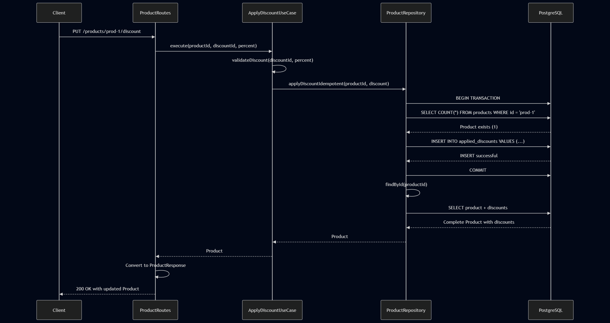

# Architecture Documentation

## System Design

The Nexure Product Discount API is built using **Clean Architecture** principles with functional programming patterns. The system ensures data consistency and idempotency through database-level constraints while maintaining a pure domain layer.

### Key Design Principles

1. **Functional Programming**: All operations use Arrow-kt `Either<Error, Success>` for error handling
2. **Data-Oriented Design**: Data structures are separate from behavior
3. **Database-Enforced Idempotency**: PostgreSQL unique constraints prevent duplicate discount applications
4. **Clean Architecture**: Dependency inversion with pure domain layer
5. **Concurrent Safety**: Thread-safe operations under high load

## Architecture Layers

```
┌─────────────────────────────────────────────────────────────┐
│                    HTTP Layer                                │
│  ┌─────────────────┐  ┌─────────────────┐                   │
│  │  ProductRoutes  │  │   DTOs/Models   │                   │
│  └─────────────────┘  └─────────────────┘                   │
└─────────────────────────────────────────────────────────────┘
                                │
                                ▼
┌─────────────────────────────────────────────────────────────┐
│                Application Layer                             │
│  ┌─────────────────┐  ┌─────────────────┐                   │
│  │ApplyDiscountUse │  │GetProductsUse   │                   │
│  │      Case       │  │      Case       │                   │
│  └─────────────────┘  └─────────────────┘                   │
└─────────────────────────────────────────────────────────────┘
                                │
                                ▼
┌─────────────────────────────────────────────────────────────┐
│                  Domain Layer                               │
│  ┌─────────────────┐  ┌─────────────────┐                   │
│  │   Models        │  │   Services      │                   │
│  │ Product, Country│  │ Validation,     │                   │
│  │ ValueObjects    │  │ Operations      │                   │
│  └─────────────────┘  └─────────────────┘                   │
│  ┌─────────────────┐                                        │
│  │  Repository     │                                        │
│  │   Interface     │                                        │
│  └─────────────────┘                                        │
└─────────────────────────────────────────────────────────────┘
                                │
                                ▼
┌─────────────────────────────────────────────────────────────┐
│              Infrastructure Layer                           │
│  ┌─────────────────┐  ┌─────────────────┐                   │
│  │ ExposedProduct  │  │  Database       │                   │
│  │  Repository     │  │  Schema         │                   │
│  └─────────────────┘  └─────────────────┘                   │
└─────────────────────────────────────────────────────────────┘
```

## Concurrency Approach

### Database-Level Idempotency

The system uses PostgreSQL unique constraints to enforce idempotency at the database level:

```sql
CREATE UNIQUE INDEX unique_product_discount
    ON applied_discounts(product_id, discount_id);
```

This ensures that even under high concurrent load, the same discount cannot be applied twice to the same product.

### Handling Concurrent Requests

When multiple clients attempt to apply the same discount simultaneously:

1. **First Request**: Successfully inserts and returns 200 OK
2. **Subsequent Requests**: Database throws unique constraint violation (SQLSTATE 23505)
3. **Application**: Catches violation and returns 409 Conflict

This approach is superior to application-level locking because:
- ✅ Database handles concurrency atomically
- ✅ No distributed locks required
- ✅ Scales under high load
- ✅ Guarantees consistency

## Sequence Diagrams

### GET /products?country={country}

The following flow diagram shows the data flow when retrieving products by country:



**Flow Description:**
1. **Client** sends GET request to `/products?country={country}`
2. **ProductRoutes** extracts country parameter and calls GetProductsByCountryUseCase
3. **GetProductsByCountryUseCase** validates the country code and calls repository
4. **ProductRepository** queries database for products and associated discounts
5. **Use Case** calculates final prices including VAT and discounts
6. **Routes** converts flow to list and returns JSON response

### PUT /products/{id}/discount

The following flow diagram shows the discount application flow, including both success and conflict scenarios:



**Success Path (Green Flow):**
1. **Client** sends PUT request with discount details
2. **ProductRoutes** validates request and calls ApplyDiscountUseCase
3. **ApplyDiscountUseCase** validates discount parameters
4. **Use Case** retrieves product from repository
5. **Domain Logic** checks if discount already applied (business rules)
6. **Repository** saves updated product with new discount
7. **Success Response** returns updated product with final price

**Conflict Path (Red Flow):**
1. **Domain Logic** detects discount already applied
2. **Immediate Return** of Conflict (409) response
3. **No Database Operation** performed for efficiency

## Functional Error Handling

### Either Railway Pattern

All domain operations use the Either railway pattern for functional error handling:

```kotlin
// Validation pipeline
validateInput()
    .flatMap { processData(it) }
    .flatMap { saveData(it) }
    .fold(
        ifLeft = { handleError(it) },
        ifRight = { handleSuccess(it) }
    )
```

### Error Types

1. **ValidationError**: Input validation failures
2. **DomainError**: Business logic failures
3. **DatabaseError**: Persistence layer failures

### Benefits

- ✅ No exceptions for expected errors
- ✅ Compile-time error handling
- ✅ Functional composition
- ✅ Explicit error paths

## Database Schema

### Tables

```sql
-- Products table
CREATE TABLE products (
    id VARCHAR(255) PRIMARY KEY,
    name VARCHAR(255) NOT NULL,
    base_price DOUBLE PRECISION NOT NULL,
    country VARCHAR(50) NOT NULL,
    created_at TIMESTAMP DEFAULT CURRENT_TIMESTAMP
);

-- Applied discounts with composite primary key
CREATE TABLE applied_discounts (
    product_id VARCHAR(255) NOT NULL,
    discount_id VARCHAR(255) NOT NULL,
    percent DOUBLE PRECISION NOT NULL,
    applied_at TIMESTAMP DEFAULT CURRENT_TIMESTAMP,

    PRIMARY KEY (product_id, discount_id),
    FOREIGN KEY (product_id) REFERENCES products(id) ON DELETE CASCADE
);

-- Critical unique index for idempotency
CREATE UNIQUE INDEX unique_product_discount
    ON applied_discounts(product_id, discount_id);
```

## Technology Stack

- **Language**: Kotlin 2.2.20
- **Framework**: Ktor 3.1.2
- **Database**: PostgreSQL with Exposed ORM
- **Functional**: Arrow-kt 2.0.0
- **Testing**: Kotest 6.0.0 + TestContainers
- **Connection Pooling**: HikariCP

## Performance Considerations

### Database Indexes
- Primary key on products.id
- Composite primary key on applied_discounts
- Unique index for idempotency enforcement
- Index on products.country for query optimization

### Connection Pooling
- HikariCP with 10 maximum connections
- 5 minimum idle connections
- Proper timeout configurations

### Concurrency Testing
- 100 simultaneous requests for same discount
- Verified: 1 success, 99 conflicts
- No race conditions or data corruption